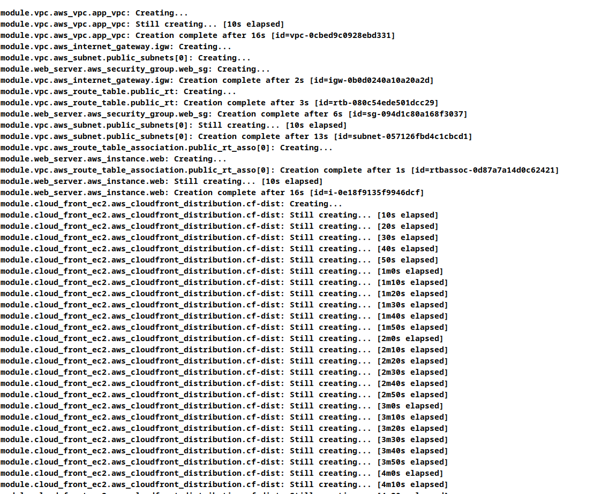

# Desafio 7 Terraform EC2

Este repositorio tiene como finalidad el poder desplegar una infraestructura en AWS utilizando terraform. Lo que vamos a realizar es crear una instancia EC2 con un servidor nginx que muestre un sitio web estatico. La forma en la cual vamos a acceder va hacer por medio de un CDN en este caso utilizamos CloudFront.


## Tabla de Contenidos
- [Requisitos](#requisitos)
- [Creacion archivo principal]()
- [Uso](#uso)
- [Contribuciones](#contribuciones)


### Requisitos
Vamos a tener que tener instalados los siguente software para poder realizar este proyecto
- Terraform CLI [Install Terraform](https://developer.hashicorp.com/terraform/tutorials/aws-get-started/install-cli)
- AWS CLI [Install aws](https://docs.aws.amazon.com/cli/latest/userguide/getting-started-install.html)

### Estructura del proyecto
Vamos a crear una estructura de directorios para organizar cada parte de nuestra infraestructura. En nuestro directorio principa creamos una carpeta llamada 'modules' dentro de esta creamos otra 3 subcarpeta con los nombres:
- cloud-front
- vpc
- ec2

y dentro de cada carpeta agregamos los archivos
* main.tf
* variables.tf
* outputs.tf

Nuestro directorio de trabajo nos quedaria de esta forma 


Ahora fuera de la carpeta modules creamos 3 archivos: provider.tf main.tf variables.tf

En el archivo provider declaramos el proveedor a utilizar en este caso AWS.

```
providers.tf
```
```bash

terraform {
  required_providers {
    aws = {
      source = "hashicorp/aws"
      version = "5.80.0"
    }
  }
}

provider "aws" {
  region = var.aws_region
}
```
```
variables.tf
```
```bash
variable "aws_region" {
  type = string
  description = "Aws region to user for resources"
  default = "us-east-1"
}
```

Con esto le estamos diciendo a terraform el proevedor a utilizar y cual va hacer la region donde va a desplegar los recursos.

### Creacion de VPC y Subnet
Dentro de la carpeta VPC en main vamos crear nuestra vpc y subnet

```
main.tf
```

```bash
resource "aws_vpc" "app_vpc" {
  cidr_block           = var.vpc_cidr_block
  enable_dns_hostnames = var.enable_dns_hostnames

  tags ={
    Name = "vpc-web"
  }
}


resource "aws_internet_gateway" "igw" {
  vpc_id = aws_vpc.app_vpc.id

  tags = 
}


resource "aws_subnet" "public_subnets" {
  vpc_id = aws_vpc.app_vpc.id

  count             = length(var.public_subnets_cidrs)
  cidr_block        = element(var.public_subnets_cidrs, count.index)
  availability_zone = element(var.aws_azs, count.index)

  map_public_ip_on_launch = true 

  tags = merge(var.common_tags, {
    Name = "${var.naming_prefix}-pubsubnet-${count.index + 1}"
  })
}

```

```
variables.tf
```

```bash
variable "name" {}
variable "aws_region" {}
variable "aws_azs" {}
variable "enable_dns_hostnames" {}
variable "vpc_cidr_block" {}
variable "public_subnets_cidrs" {}
variable "common_tags" {}
variable "naming_prefix" {}

```

```
outputs.tf
```

```bash
output "vpc_id" {
  value = aws_vpc.app_vpc.id
}

output "public_subnets" {
  value = aws_subnet.public_subnets.*.id
}

output "public_route_table_id" {
  value = aws_route_table.public_rt.id
}
```


El archivo de variables.tf solo las declaramos. Las vamos a utilizar en el archivo main que tenemos en directorio principal cuando llamemos a cada modulo de nuestra aplicacion

### Utilizar nuestro modulo VPC
Ya con esto podemos testear si lo que creamos hasta ahora va todo bien.
En nuestro archivo main y variables ponemos esto.

```
main.tf
```

```bash
module "vpc" {
  source               = "./modules/vpc"
  name                 = "VPC-A"
  aws_region           = var.aws_region
  vpc_cidr_block       = var.vpc_cidr_block #"10.1.0.0/16"
  public_subnets_cidrs = [cidrsubnet(var.vpc_cidr_block, 8, 1)]
  enable_dns_hostnames = var.enable_dns_hostnames
  aws_azs              = var.aws_azs
  common_tags          = "vpc_server-web"
  naming_prefix        = "vpc_server-web"
}

```

```
variables.tf
```

```bash
variable "aws_azs" {
  type        = list(string)
  description = "AWS Availability Zones"
  default     = ["us-east-1a"]
}

variable "enable_dns_hostnames" {
  type        = bool
  description = "Enable DNS hostnames in VPC"
  default     = true
}

variable "vpc_cidr_block" {
  type        = string
  description = "Base CIDR Block for VPC"
  default     = "10.0.0.0/16"
}

variable "vpc_public_subnets_cidr_block" {
  type        = list(string)
  description = "CIDR Block for Public Subnets in VPC"
  default     = ["10.0.101.0/24"]
}
```
Como podemos ver estamos utilizando los recursos que definimos en nuestro main de vpc y tambien sus respectivas variables. Ahora corremos los siguentes comandos

```bash
terraform init
terraform plan
```
Si con terraform plan no sale por consola los recursos que va a crear, significa que vamos por buen camino

### Creamos la instacia EC2 y Security group
En la carpeta ec2 vamos a poner nuestros recursos de ec2 y security group

-----------------------------
```
main.tf
```

```bash

resource "aws_security_group" "web_sg" {
  vpc_id = var.vpc_id

  ingress {
    from_port   = 22       
    to_port     = 22
    protocol    = "tcp"
    cidr_blocks = ["0.0.0.0/0"]
  }

  ingress {
    from_port   = 80       
    to_port     = 80
    protocol    = "tcp"
    cidr_blocks = ["0.0.0.0/0"]
  }

  egress {
    from_port   = 80
    to_port     = 80
    protocol    = "tcp"
    cidr_blocks = ["0.0.0.0/0"]  
  }


  tags = {
    Name = "servidor-web-sg"
  }
}


resource "aws_instance" "web" {
  ami           = var.ami-linux
  instance_type = var.intance_type
  subnet_id     = aws_subnet.public.id
  security_groups = [aws_security_group.web_sg.name]

  user_data = <<-EOF
              #!/bin/bash
              yum update -y
              yum install -y nginx
              systemctl start nginx
              systemctl enable nginx

              instanceId=$(curl http://169.254.169.254/latest/meta-data/instance-id)
              instanceAZ=$(curl http://169.254.169.254/latest/meta-data/placement/availability-zone)
              pubHostName=$(curl http://169.254.169.254/latest/meta-data/public-hostname)
              pubIPv4=$(curl http://169.254.169.254/latest/meta-data/public-ipv4)
              privHostName=$(curl http://169.254.169.254/latest/meta-data/local-hostname)
              privIPv4=$(curl http://169.254.169.254/latest/meta-data/local-ipv4)
              
              echo "<font face = "Verdana" size = "5">"                               > /var/www/html/index.html
              echo "<center><h1>AWS Linux VM Deployed with Terraform</h1></center>"   >> /var/www/html/index.html
              echo "<center> <b>EC2 Instance Metadata</b> </center>"                  >> /var/www/html/index.html
              echo "<center> <b>Instance ID:</b> $instanceId </center>"                      >> /var/www/html/index.html
              echo "<center> <b>AWS Availablity Zone:</b> $instanceAZ </center>"             >> /var/www/html/index.html
              echo "<center> <b>Public Hostname:</b> $pubHostName </center>"                 >> /var/www/html/index.html
              echo "<center> <b>Public IPv4:</b> $pubIPv4 </center>"                         >> /var/www/html/index.html
              echo "<center> <b>Private Hostname:</b> $privHostName </center>"               >> /var/www/html/index.html
              echo "<center> <b>Private IPv4:</b> $privIPv4 </center>"                       >> /var/www/html/index.html
              echo "</font>"                                                          >> /var/www/html/index.html
    EOF

  tags = {
    Name = "web-server-nginx"
  }
}

```
---------------------------
```
variables.tf
```
```bash
variable "instance_type" {}
variable "ami-linux" {}
variable "subnet_id" {}
variable "ec2_name" {}
variable "vpc_id" {}
```
--------------------------
```
outputs.tf
```
```bash
output "ec2_instance_id" {
  value = aws_instance.web.id
}

output "security_group_id" {
  value = aws_security_group.security_group.id
}

output "public_ip" {
  value = aws_instance.web.public_ip
}

output "ec2_public_dns" {
  value = aws_instance.web.public_dns
}
```

Con esto ya tenemos listo nuestra instancia con su respectivo grupo de seguridad para puedan acceder a nuestro sitio por http

### Utilizar nuestro modulo de EC2

Ahora en el archivo main principal vamos a utilizar el modulo que acabamos de hacer.

-----------------------------
```
main.tf
```

```bash
module "web_server" {
  source           = "./modules/web"
  instance_type    = var.instance_type
  subnet_id        = module.vpc.public_subnets[0]
  vpc_id           = module.vpc.vpc_id
  ec2_name         = "Web Server"
}

```
----------------------------
```
main.tf
```

```bash
variable "instance_type" {
  type        = string
  description = "Type for EC2 Instance"
  default     = "t2.micro"
}

variable "ami-linux" {
  default = ami-0ff8a91507f77f867
}
```

Corremos el comando
```bash
terraform init (lo ejeuctamos nuevamente porque acabamos de agregar un nuevo modulo)
terraform plan
```
Si nos devuelve nuevamente todos los recursos que va a crear seguimos por buen camino

### Crear CloudFront para la instacia EC2

Ahora debemos crear el recurso de CloudFront para esto vamos a pegar lo siguente en los archivos del Modulo cloudFront

```bash
resource "aws_cloudfront_distribution" "cf-dist" {
  enabled             = true
  default_root_object = "index.html"

  origin {
    domain_name = var.ec2_public_dns
    origin_id   = var.ec2_public_dns
    custom_origin_config {
      http_port              = 80
      https_port             = 443
      origin_protocol_policy = "http-only"
      origin_ssl_protocols   = ["TLSv1.2"]
    }
  }

  default_cache_behavior {
    allowed_methods  = ["GET", "HEAD"]
    cached_methods   = ["GET", "HEAD"]
    target_origin_id = var.ec2_public_dns
    forwarded_values {
      query_string = false

      cookies {
        forward = "none"
      }
    }
    viewer_protocol_policy = "allow-all"
    min_ttl                = 0
    default_ttl            = 3600
    max_ttl                = 86400
  }

  price_class = "PriceClass_All"

  viewer_certificate {
    cloudfront_default_certificate = true
  }
}
```

variables.tf

```bash
variable "common_tags" {}
variable "naming_prefix" {}
variable "ec2_public_dns" {}
```
outputs.tf
```bash
output "cloudfront_distribution_arn" {
  value = aws_cloudfront_distribution.cf-dist.arn
}
output "cloudfront_distribution_domain_name" {
  value = aws_cloudfront_distribution.cf-dist.domain_name
}
```

Con esto ya tenemos el recurso de cloudFront creado.
Vamos a utilizar ese modulo en el archivo principal main.tf

```bash
module "cloud_front_ec2" {
  source         = "./modules/cloudFront"
  ec2_public_dns = module.web_server.ec2_public_dns
}
```
Con esto ya puesto. Podemos proceder a escribir los comandos 
Terraform init para inicializar el proyecto nuevamente.
Terraform plan asi vemos todo lo que se nos va a crear

Si nos sale algo parecido por consola ya podemos correr el comando
"terraform apply" para levantar todos nuestros recursos en AWS

```bash
terraform init
terraform plan
terraform apply
```



Como se puede ver aca se nos creo todos nuestros recursos en AWS.
Ahora entrariamos al output que configuramos anterior mente para que nos muestre la url de cloudFront y con eso ya podemos entrar a nuestro sitio


